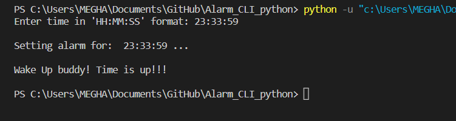

# Alarm_CLI_python⏰
## Technology Used💎
- ### PYTHON


## How to configure:🧐

**1.** Clone this repository to your local drive
```shell
 $ git clone https://github.com/Meghaanil/Alarm_CLI_python.git
```
**2.** Move to the directory

```
$ cd Alarm_CLI_python/
```
<p align="center">
 ⭐🌟 Star this repository if you find it useful.🌟⭐
</p>
